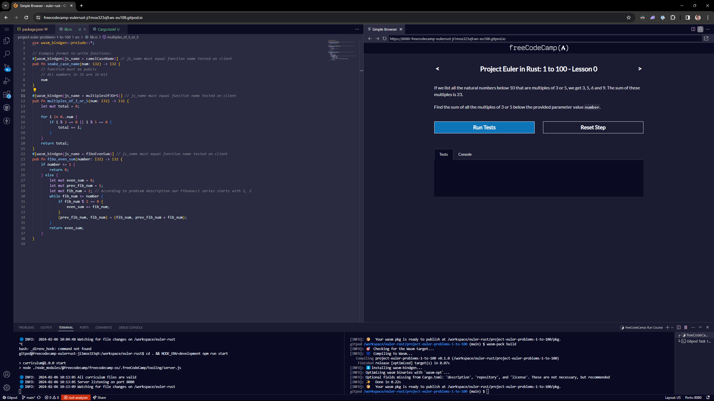

# freeCodeCamp - Project Euler with Rust

## Course Desciption

This enables you to complete the [Project Euler](https://projecteuler.net/) problems in Rust.

#

## How to Get Started

Read the [article on `/news`](https://www.freecodecamp.org/news/project-euler-problems-in-rust/)

## WASM Specific

- Numbers in JS are only `i32` or `f32`

## Notes

- It can take a few minutes to install all the dependencies/tools, on first start. The terminal will tell you its progress.
