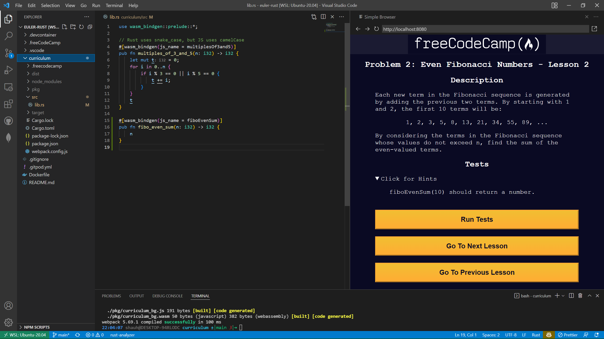

# freeCodeCamp - Project Euler with Rust

## Course Desciption

This enables you to complete the [Project Euler](https://projecteuler.net/) problems in Rust.

#

## How to Get Started

Open in Gitpod: https://gitpod.io/#https://github.com/ShaunSHamilton/euler-rust/

Failing the first test should give you the function name you need for the instructions.

You can write all the functions within one file, and follow the pattern given for the first example.

1. `Ctrl + Shift + P` and `freeCodeCamp: Run Course`
2. `npm run build` to compile the Rust code, before each test.

## WASM Specific

- Numbers in JS are only `i32` or `f32`

## Notes

- It can take a few minutes to install all the dependencies/tools, on first start. The terminal will tell you its progress.
